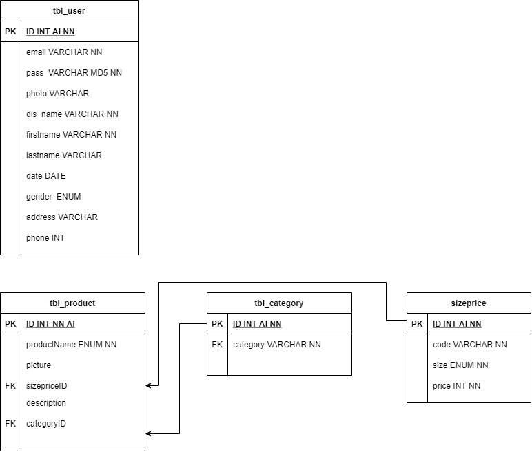

## REST API USER, PRODUCTS, CATEGORY

**Adalah sebuah rest api yang digunakan untuk crud data user products dan category**

Flow database programs


**1. Exsport file sql (file db/week.13) ke mysql**

**2. install node modules and bcrypct**
```
npm install
```
**bcrypt**
```
npm install bcrypt
```
**3. copy env example to .env**
```
isi user mysql dan password mysql 
```

## GET USERS, PRODUCTS, CATEGORY
Method = get
### Request
```
ip:/2000/
```
### Response
```
"success": true,
"data": []
"code": 200,
"message": "get data success"
```
## GET DETAILS USERS, PRODUCTS, CATEGORY
Method = get

### Request
```
ip:/2000/id
```
### Response
```
"success": true,
"data": []
"code": 200,
"message": "get details data success"
```
## POST DATA USERS , PRODUCTS, CATEGORY
Method = post
### Request
```
ip:/2000/
```
### Response
```
"success": true,
"data": []
"code": 200,
"message": "post data success"
```
## UPDATE DATA USERS , PRODUCTS, CATEGORY
Method = put
### Request
```
ip:/2000/id
```
### Response
```
"success": true,
"data": []
"code": 200,
"message": "update data success"
```
## DELETE DATA USERS , PRODUCTS, CATEGORY
Method = delete
### Request
```
ip:/2000/
```
### Response
```
"success": true,
"data": []
"code": 200,
"message": "dellete data success"
```
## LOGIN USERS 
Method = post
### Request
```
ip:/2000/
```
### Response
```
"message": "Login successfull",
"token": 123
```
